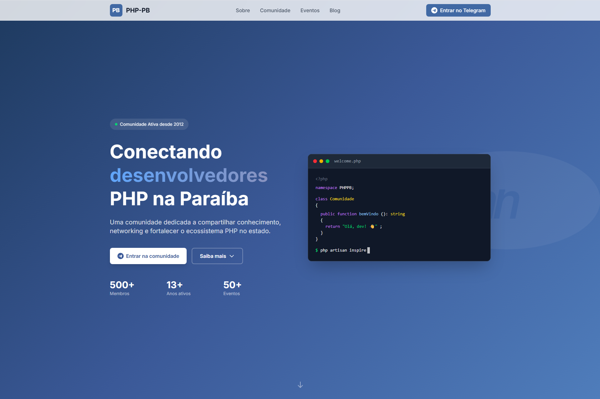

# PHP-PB - Comunidade PHP da Paraíba



<p align="center">
  <a href="https://php-pb.net"></a>
  <a href="https://t.me/phppb"></a>
  <a href="https://github.com/php-pb/php-pb.github.io/blob/main/LICENSE"></a>
  
  
  
</p>

<p align="center">
  <strong>Conectando desenvolvedores PHP na Paraíba desde 2012</strong>
</p>

---

## Sobre

A **PHP-PB** é uma comunidade de desenvolvedores PHP do estado da Paraíba, Brasil. Nossa missão é promover a interatividade entre pessoas interessadas na linguagem de programação PHP, compartilhando conhecimento através de meetups, hangouts, artigos e eventos.

### O que fazemos

- **Grupo no Telegram** - Discussões diárias sobre PHP, Laravel, dúvidas técnicas
- **Meetups & Hangouts** - Encontros presenciais e online com palestras
- **Blog** - Artigos técnicos escritos pela comunidade
- **Vagas** - Oportunidades de emprego compartilhadas
- **PHPeste** - Organizamos junto com outras comunidades a maior conferência PHP do Nordeste

## Stack

| Tecnologia | Versão | Descrição |
|------------|--------|-----------|
| **Laravel** | 12 | Framework PHP |
| **Livewire** | 4 | Componentes reativos full-stack |
| **Tailwind CSS** | 4 | Framework CSS utility-first |
| **Alpine.js** | 3 | Interatividade (incluso no Livewire) |
| **MySQL** | 8 | Banco de dados |
| **FilamentPHP** | 5 | Painel administrativo |

## Estrutura do Projeto

```
php-pb.github.io/
├── site_novo/           # Projeto Laravel (TALL Stack)
│   ├── app/
│   ├── resources/
│   │   └── views/
│   │       └── components/
│   │           └── landing/    # Componentes Livewire da landing
│   ├── routes/
│   └── ...
├── site_antigo/         # Site Jekyll original (backup/referência)
├── docker-compose.yml   # Configuração Docker
├── README.md
└── CONTRIBUTING.md
```

## Instalação

### Com Docker (Recomendado)

```bash
# Subir os containers
docker-compose up -d

# Instalar dependências PHP
docker-compose exec app composer install

# Instalar dependências Node
docker-compose exec app npm install

# Gerar key da aplicação
docker-compose exec app php artisan key:generate

# Rodar migrations
docker-compose exec app php artisan migrate

# Build dos assets
docker-compose exec app npm run build
```

Acesse: http://localhost:8080

### Sem Docker

```bash
cd site_novo

# Instalar dependências
composer install
npm install

# Configurar ambiente
cp .env.example .env
php artisan key:generate

# Banco de dados (SQLite para desenvolvimento)
touch database/database.sqlite
php artisan migrate

# Iniciar servidor
php artisan serve
npm run dev
```

Acesse: http://localhost:8000

## Comandos Docker

```bash
# Subir containers
docker-compose up -d

# Parar containers
docker-compose down

# Ver logs
docker-compose logs -f app

# Acessar container
docker-compose exec app bash

# Rodar Artisan
docker-compose exec app php artisan <comando>

# Rodar NPM
docker-compose exec app npm run <comando>
```

## Desenvolvimento

```bash
# Criar componente Livewire (v4 usa arquivos únicos)
php artisan make:livewire NomeComponente

# Criar Model com Migration
php artisan make:model NomeModel -m

# Rodar testes
php artisan test

# Build para produção
npm run build

# Modo desenvolvimento (com hot reload)
npm run dev
```

## Comunidades Parceiras

Fazemos parte de uma rede de comunidades PHP do Nordeste:

| Comunidade | Estado | Link |
|------------|--------|------|
| **PHP-PB** | Paraíba | [php-pb.net](https://php-pb.net) |
| **PHP com Rapadura** | Ceará | [phpcomrapadura.org](https://phpcomrapadura.org) |
| **PHP-PE** | Pernambuco | - |
| **PHP-RN** | Rio Grande do Norte | - |

Juntos organizamos o **[PHPeste](https://phpeste.dev)** - a maior conferência PHP do Nordeste brasileiro!

## Links

- [Site Oficial](https://php-pb.net)
- [Telegram](https://t.me/phppb)
- [GitHub](https://github.com/php-pb)
- [Twitter/X](https://twitter.com/phppb)
- [Facebook](https://www.facebook.com/groups/php.pb)


---

<p align="center">
  Feito com amor pela comunidade PHP-PB
</p>

